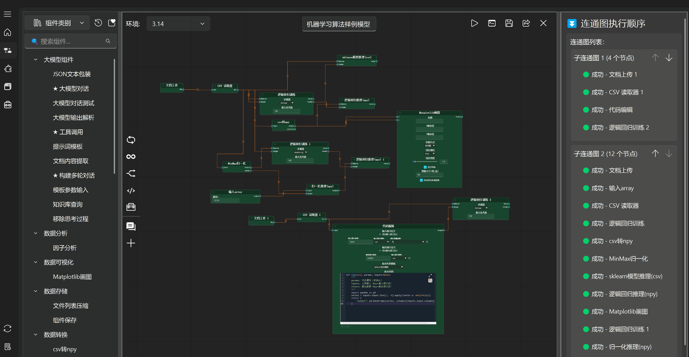
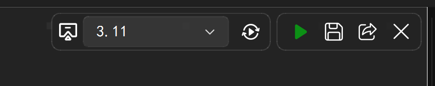

==================
画布UI功能
==================

环境切换
------------------

可以选择当前画布使用环境管理中已有的环境进行画布运行

特殊组件+快捷组件栏
------------------

特殊组件+快捷组件栏 上半部分是特殊组件，下半部分是快捷组件。

**特殊组件共有：**

- 迭代组件
- 循环组件
- 分支组件
- 代码运行组件
- 触发器组件
- 注释组件

快捷组件点击 + 号弹出快捷组件添加对话窗，选择组件及对应的图标后即可添加到快捷组件栏。

特殊组件+快捷组件栏 中的组件 左键单击 即可自动创建到当前选中节点的右侧，方便组件连接，当无选中节点时，会创建在当前画布视角中心。

.. image:: ../_images/快捷组件栏功能.gif

画布通用功能按钮
------------------

由左至右分别为：

- 运行环境选择
- 运行环境重启
- 画布运行
- 画布保存
- 项目导出
- 画布关闭

画布控制功能按钮
------------------

由左至右分别为：

- 切换 框选 / 拖拽 模式
- 画布视角重置
- 侧边栏开启 / 关闭
- 画布视角拆分
- 画布显示设置

