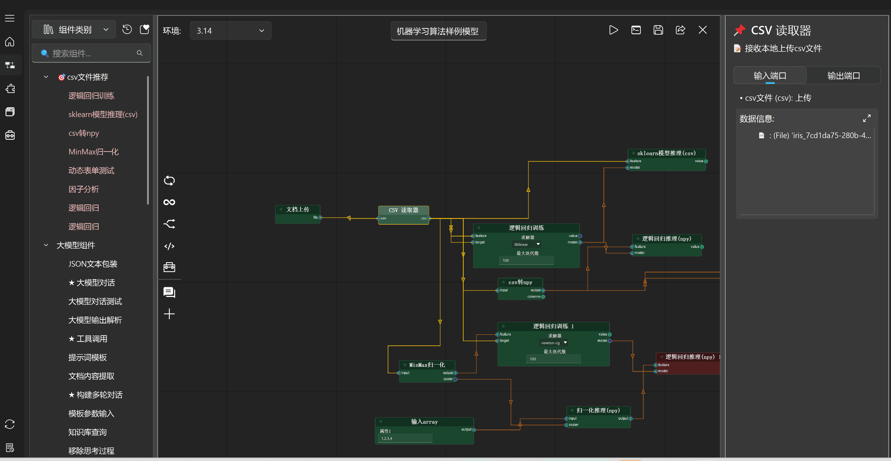
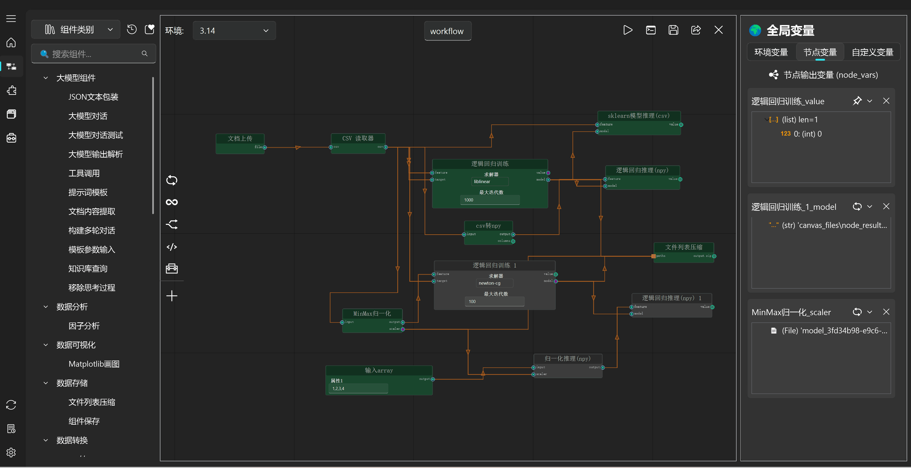
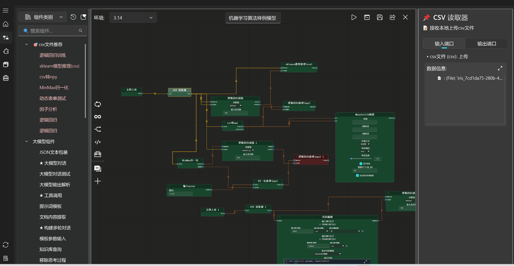
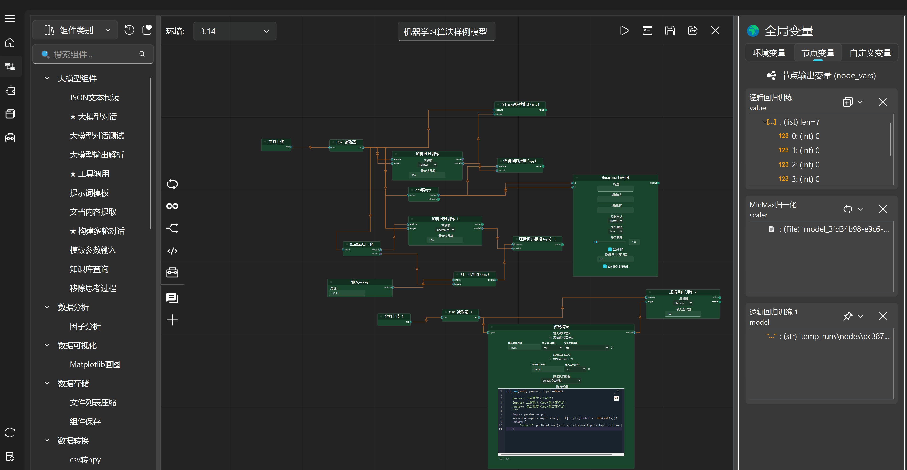

==================
画布执行模式
==================

单独运行一个节点
-----------------

单独运行选定的节点

运行到此处
-----------------

将选中节点上游节点按照拓扑排序顺序执行

从此处运行
-----------------

将选中节点下游节点按照拓扑排序顺序执行

选择节点运行
-----------------

使用 shift + 鼠标左键 或 shift + 长按鼠标左键拖动 选中多个节点，
使用 ctrl + 鼠标左键 或 ctrl + 长按鼠标左键拖动 取消选中多个节点

自动计算选中结果拓扑排序连通图列表，并可自定义连通图执行顺序。

.. image:: ../_images/选择节点运行.gif

整个画布运行
-----------------

运行画布中所有节点

