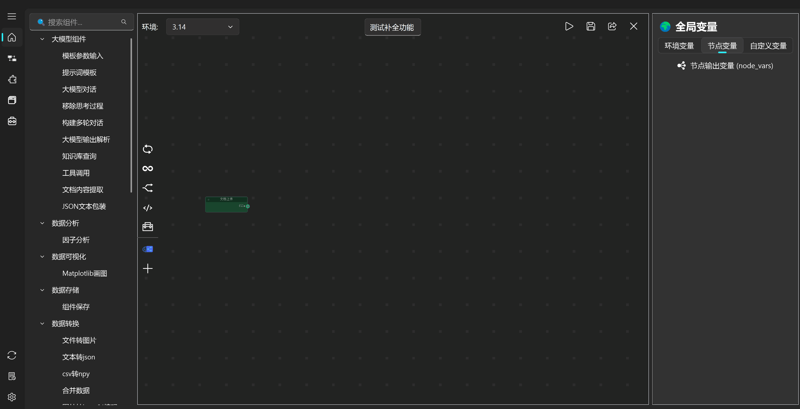

==================
画布节点智能推荐
==================

智能推荐系统
---------------

在节点拖拽树的基础上，本工具进一步集成了**上下文感知的智能推荐系统**。当用户选中某个节点的输出端口时，系统会自动在拖拽树顶部或侧边（可配置）动态展示一组**高相关性候选节点**，推荐逻辑综合以下维度：

- **端口类型匹配**：优先推荐输入端口类型与当前输出类型兼容的节点，确保连接合法性；
- **全局连接统计**：基于历史使用数据，对在其他画布中高频连接的节点组合进行加权排序；
- **使用频次与热度**：结合组件整体使用次数与近期活跃度，将更实用的节点前置；
- **跨画布知识迁移**：推荐策略全局共享，学习用户在所有项目中的连接偏好，实现“越用越聪明”。

推荐列表以醒目标识（如 🎯 端口：data → 推荐补全）呈现，用户可直接拖拽推荐项完成快速连接，大幅减少查找与试错成本。

使用示例
------------
