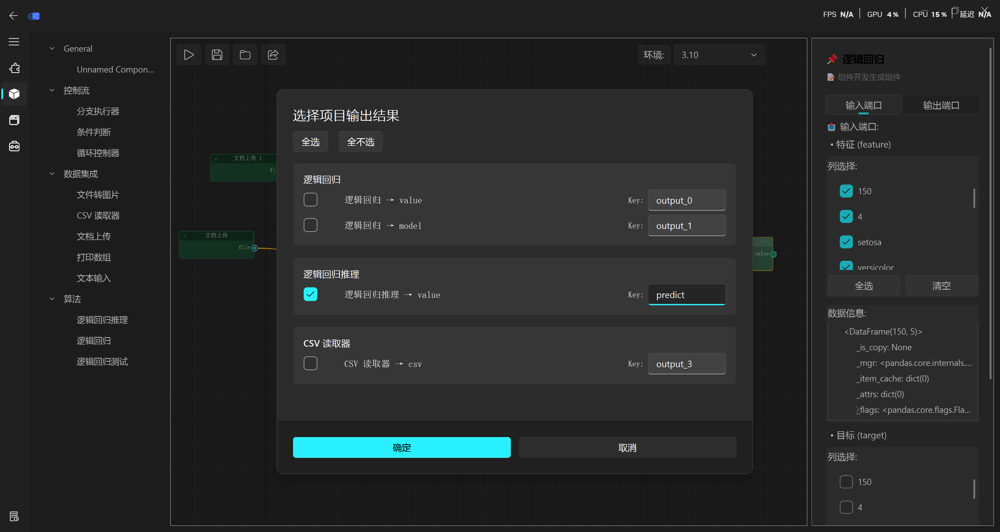
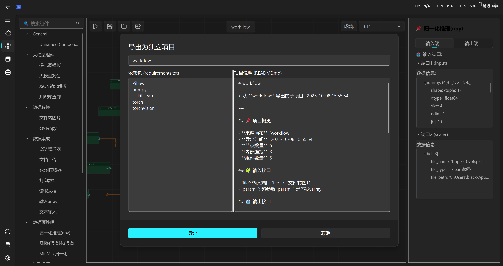

==================
画布项目导出
==================

1. 画布选择节点：

2. 连通图执行顺序设定：

.. image:: ../_images/子连通图执行顺序定义示意图.png

3. 点击导出按钮：

4. 导出项目输入参数选择：

.. image:: ../_images/子图导出项目输入参数选择示意图.png

5. 导出项目输出参数选择：

6. 导出项目信息配置：

