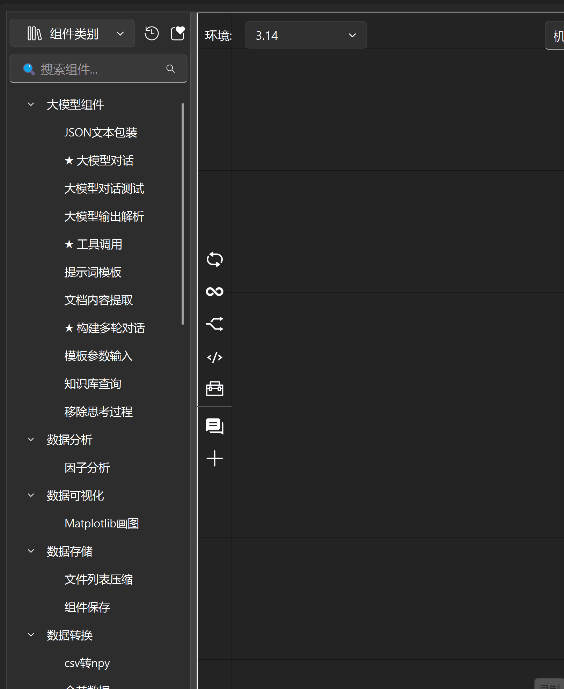

==================
节点拖拽树
==================

核心功能特性：
---------------

- **智能分类过滤**

  支持通过类别下拉菜单（支持多选）快速筛选组件，用户可按功能模块（如“数据处理”、“视觉识别”、“AI模型”）精准定位所需节点。

- **实时搜索与高性能匹配**

  集成 ``SearchLineEdit`` 搜索框，支持模糊匹配与关键词高亮，即使在数千个组件中也能实现毫秒级响应，搜索结果按相关性与使用频率智能排序。

- **使用行为驱动的智能排序**

  组件列表自动按“最近使用”、“近一周”、“近一月”及“按年分组”等时间维度分组展示，帮助用户快速访问高频组件。同时，每项组件旁显示使用次数图标，直观反映流行度。

- **收藏夹系统**

  用户可通过星号按钮将常用组件加入收藏夹，收藏项独立分组展示，支持与分类、搜索功能组合使用，构建个性化组件工作区。

- **拖拽预览与说明提示**

  拖拽组件时，自动显示简洁、清晰的说明卡片，包含组件功能摘要、输入/输出端口类型及使用建议，减少认知负担，提升操作准确性。

使用示例
---------------

