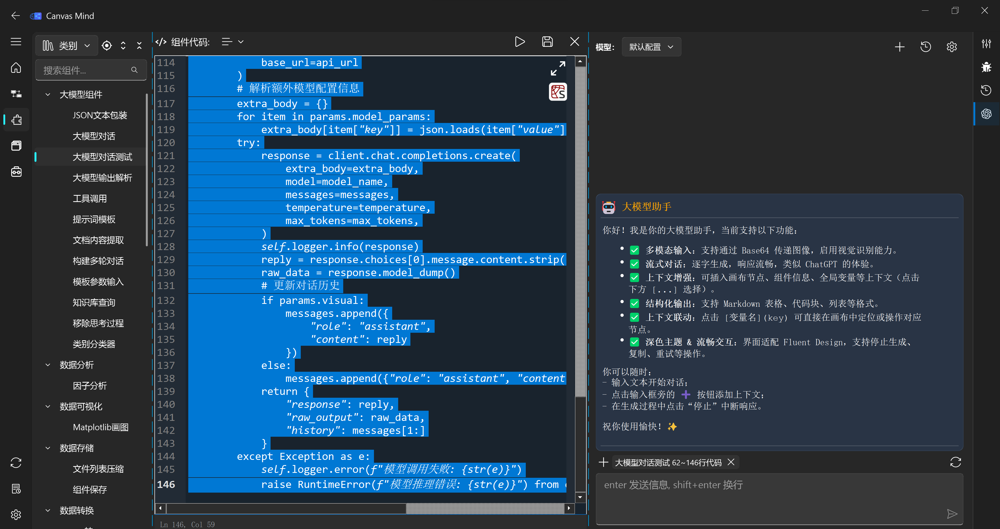

==================
组件开发大模型助手
==================

Canvas Mind 平台不仅是一个强大的低代码/无代码画布构建工具，更是一个集成了前沿大语言模型（LLM）的智能开发环境。通过内置的“大模型助手”，开发者可以利用 AI 的强大能力来辅助编写、调试和优化组件代码，极大地提升开发效率和代码质量。

大模型助手界面示意图
------------------

如图所示，大模型助手面板位于组件开发界面的右侧边栏。它提供了一个类似 ChatGPT 的对话式交互界面，并深度集成了当前组件的上下文信息，使您能够进行精准、高效的 AI 辅助开发。

核心功能
--------

### 1. 上下文增强 (Context Enhancement)

这是本平台大模型功能的核心亮点。助手不仅能理解您的自然语言指令，还能**自动感知并插入当前组件的完整上下文**，包括：

*   **当前组件代码**：无论是整个文件还是选中的部分代码块。
*   **组件元数据**：组件名称、分类、描述等基本信息。

**操作指南：**

1.  在代码编辑器中，选中您希望 AI 分析或修改的代码段。
2.  点击大模型助手输入框旁的 **+** 按钮，或直接点击下方 `[...]` 菜单。
3.  从弹出的菜单中选择“当前选中区域”或“当前代码”，即可将对应的上下文信息插入到对话历史中。
4.  输入您的指令，例如：“请为这段代码添加错误处理逻辑”或“帮我优化这段循环”。

### 2. 流式对话与结构化输出

*   **流式响应**：AI 的回复会逐字生成，给您带来流畅、自然的交互体验，如同与真人对话。
*   **结构化输出**：助手支持以 Markdown 格式输出结果，包括：
    *   **代码块**：生成的代码会以高亮语法的形式呈现，方便您直接复制粘贴。
    *   **表格**：用于展示数据对比或参数列表。
    *   **列表**：用于罗列步骤、要点或建议。

**操作指南：**

1.  在大模型助手面板中，直接在输入框内输入您的问题或指令。
2.  按下回车键或点击发送按钮，开始与 AI 对话。
3.  在 AI 生成回复的过程中，您可以点击“停止”按钮随时中断。
4.  对于生成的代码，可以直接复制粘贴到编辑器中；对于带有 `[变量名] (key)` 的文本，点击即可在画布中定位。

通过这套强大的大模型助手，您可以将 AI 变成您的私人编程顾问，无论是代码生成、Bug 修复、性能优化还是文档撰写，都能得到及时、准确的帮助，让您专注于业务逻辑的创新，而非重复性的编码工作。