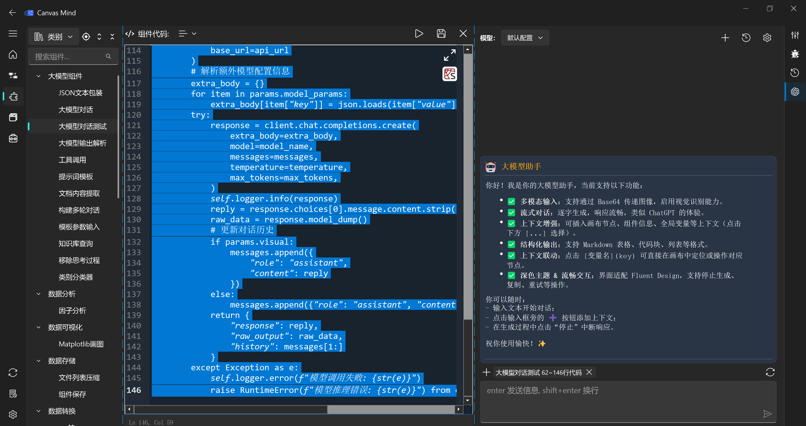

==================
组件开发大模型助手
==================

.. note::

    大模型功能的完整说明已移至 :doc:`../llm_integration`，包括黄色跳转按钮、紫色创建按钮、多模态上下文注入等核心特性的详细使用指南。

CanvasMind 平台集成了前沿大语言模型（LLM）能力，通过内置的"大模型助手"，开发者可以利用 AI 辅助编写、调试和优化组件代码。

大模型助手界面示意图
------------------

核心功能
--------

1. **上下文增强** - 自动感知当前组件代码或选中代码段作为上下文
2. **流式对话** - AI 逐字生成回复，支持 Markdown 结构化输出
3. **画布上下文联动** - 黄色跳转按钮、紫色创建按钮，实现端到端智能补全

操作指南
~~~~~~~~

1. 在代码编辑器中选中代码段
2. 点击 **+** 按钮注入上下文
3. 输入指令并发送
4. 点击黄色/紫色按钮进行画布操作

详细说明请参考 :doc:`../llm_integration`。