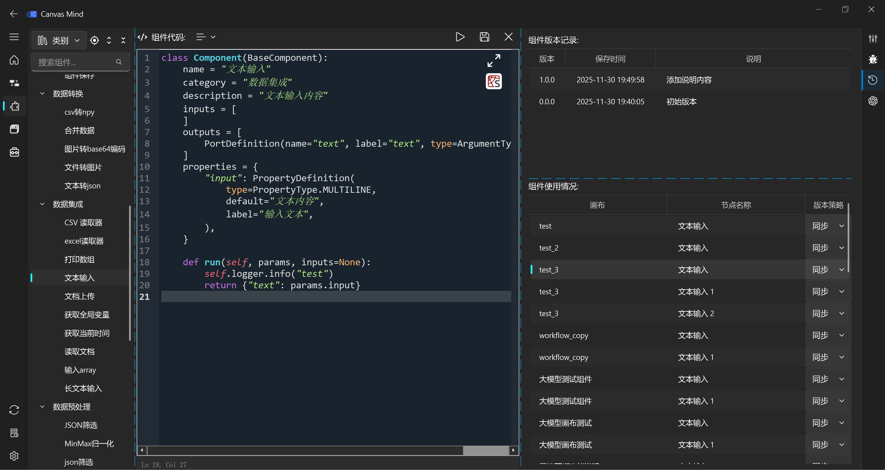

==================
组件版本管理
==================

在 Canvas Mind 平台中，组件是构建画布（Workflow）的基本单元。为了保障项目稳定性和团队协作效率，平台提供了一套完整的组件版本管理系统。该系统允许开发者对组件进行版本迭代、追踪历史修改，并精确控制已部署画布中组件的版本策略。

组件版本管理示意图
------------------

如图所示，组件版本管理功能集成在组件开发面板的右侧边栏中，主要包含两个核心部分：

*   **组件版本记录**：展示该组件的所有历史版本。
*   **组件使用情况**：列出所有当前正在使用此组件的画布及节点。

版本修改记录
------------

每次保存组件时，系统都会自动创建一个新版本，并记录以下信息：

*   **版本号 (Version)**：
    *   采用语义化版本规范（Semantic Versioning），格式为 ``major.minor.patch``。
    *   **大版本 (Major)**：当组件的输入/输出端口或属性定义发生不兼容变更时，版本号将升级（例如从 `1.0.0` 升级到 `2.0.0`）。
    *   **小版本 (Minor)**：当仅修改组件内部代码逻辑，而不影响外部接口时，版本号将升级（例如从 `1.0.0` 升级到 `1.1.0`）。
    *   **补丁版本 (Patch)**：用于修复 Bug 或进行微小优化，不影响接口和功能（例如从 `1.0.0` 升级到 `1.0.1`）。
*   **保存时间 (Save Time)**：记录该版本被保存的具体日期和时间。
*   **说明 (Description)**：开发者可以在此处为每个版本添加自定义的说明文字，例如 “修复文本截断问题”、“支持 Base64 图像输入” 等，以便于团队成员快速理解该版本的变更内容。

**操作指南：**

1.  在组件开发界面，点击右上角的“历史”图标即可打开版本管理面板。
2.  在“组件版本记录”表格中，双击“说明”列的单元格，即可直接编辑该版本的描述。
3.  编辑完成后，按回车键或点击其他地方，系统会自动保存您的修改。

画布使用情况统计
----------------

此部分清晰地展示了当前组件在哪些画布中被引用，以及每个引用点所采用的版本策略。

*   **画布 (Canvas)**：显示使用该组件的画布文件名（不含 `.workflow.json` 后缀）。
*   **节点名称 (Node Name)**：显示画布中具体使用该组件的节点名称。
*   **版本策略 (Version Strategy)**：
    *   **同步 (Sync)**：表示该节点将始终使用组件的最新版本。当组件发布新版本时，该节点会自动更新。
    *   **固定版本 (Fixed Version)**：表示该节点被锁定在某个特定版本（如 `1.0.0`）。即使组件发布了新版本，该节点也不会自动更新，以保证业务稳定性。

**操作指南：**

1.  在“组件使用情况”表格中，点击“版本策略”列的下拉菜单。
2.  选择您希望应用的策略：“同步”或具体的版本号。
3.  选择后，系统会立即更新画布配置文件，确保策略生效。

**重要提示：**
*   当组件进行大版本升级时，系统会自动标记可能受影响的画布，建议您在升级前仔细检查并手动调整相关节点的版本策略。
*   使用“同步”策略可以简化维护，但请务必在测试环境中验证新版本的稳定性后再应用于生产环境。

通过这套强大的版本管理系统，您可以轻松地管理组件的生命周期，确保团队协作顺畅无阻，并有效规避因版本不一致导致的线上故障。