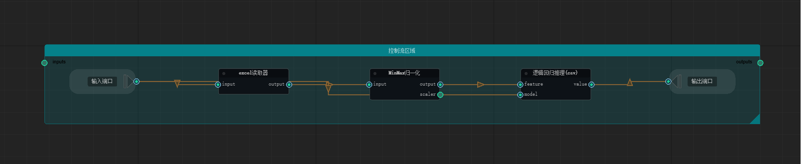

============
控制流
============

🔁 高级控制流支持

CanvasMind 提供强大的控制流节点，支持动态表达式驱动，实现复杂的逻辑编排：

支持的控制流类型
---------

- **条件分支（Conditional Branch）**: 使用 ``节点动态特征`` 动态启用/禁用分支，实现 if/else 逻辑
- **循环节点（Loop Node）**: 支持固定次数或条件驱动的迭代循环
- **迭代节点（Iterator）**: 遍历列表/字典，对每个元素执行子流程
- **表达式驱动**: 分支条件、循环次数等均支持 ``$...$`` 动态表达式

Loop Node
==============

.. image:: _images/循环节点执行示意图.gif
   :width: 800px
   :align: center
   :alt: Loop Control

Branch Node
==============

.. image:: _images/分支执行效果示意图.gif
   :width: 800px
   :align: center
   :alt: Branch Execution