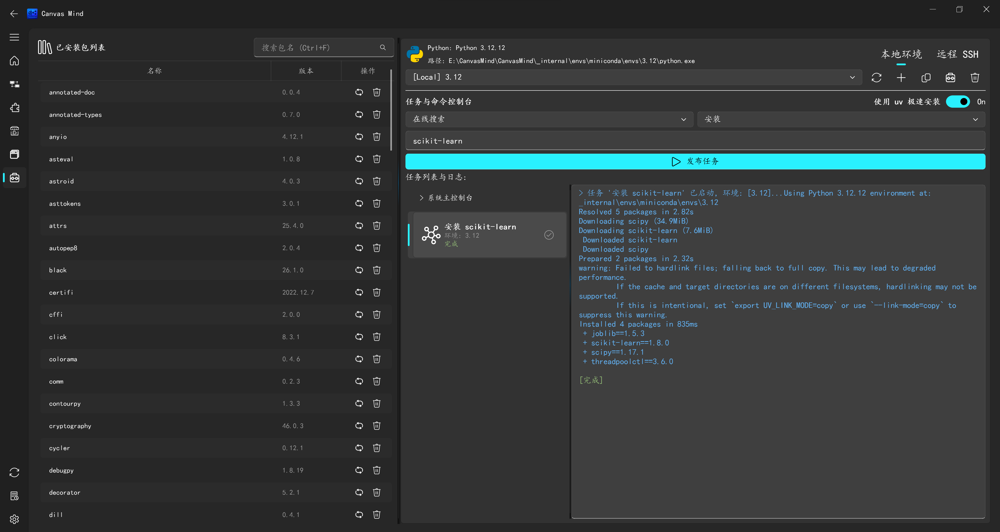

==================
环境管理介绍
==================

CanvasMind 支持多环境管理，包括本地环境和远程 SSH 服务器环境。

环境管理
------------------

**新建环境**
    创建新的 Python 执行环境，支持配置环境名称、Python 版本等参数。

**克隆环境**
    复制现有环境配置，快速创建新的执行环境。

**删除环境**
    删除不再需要的执行环境，释放系统资源。

安装包管理
------------------

**1. 在线安装方式**

- 安装：从 PyPI 安装指定的 Python 包
- 强制重装：强制重新安装包，忽略已安装版本
- 更新：将包更新至最新版本
- 卸载：从环境中移除指定的包

**2. 本地安装方式**

- 联网安装：通过网络从镜像源安装包
- 离线安装：导入本地已下载的包文件进行安装

远程 SSH 环境
------------------

CanvasMind 支持通过 SSH 连接到远程服务器，并将计算任务分发到远程执行：

- **远程连接管理**：支持配置多个 SSH 服务器连接信息
- **环境自动同步**：自动将本地环境配置同步到远程服务器
- **任务分发执行**：将高算力消耗任务（如模型训练、推理）分发至远程执行
- **统一状态监控**：在单个画布上实时可视化本地和远程节点的运行状态

