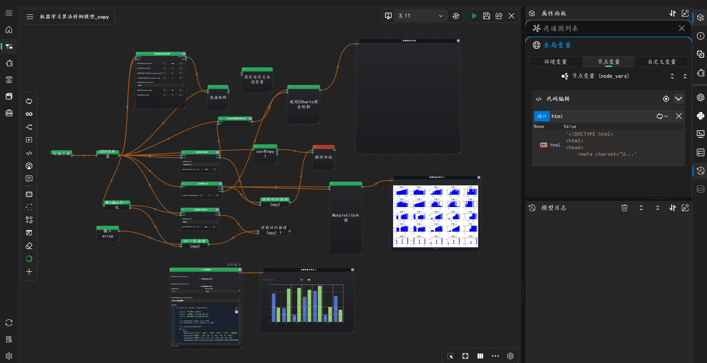

====================
Execution Engine
====================

⚡ 分布式混合执行引擎

核心特性
--------

**并行 DAG 执行**
    通过高性能任务调度器并发执行独立的分支任务，最大化提升整个工作流在多核 CPU/GPU 上的利用率。

**混合运行时编排 (Hybrid Runtime)**
    - **交互式 IPython 内核**: 利用本地持久化会话实现快速代码调试与内存状态保留
    - **远程 SSH 工作节点**: 将高算力消耗任务（如模型训练、大规模推理）透明地分发至远程服务器

**选择性内存持久化 (缓存机制)**
    用户可对特定节点开启"常驻内存"功能；执行结果将直接缓存在活动进程的 RAM 中，消除冗余计算与 I/O 开销。

**智能拓扑分发**
    系统根据节点配置自动解析依赖关系，并将任务精准路由至最佳目标执行环境（本地、远程服务器或 IPython 内核）。

**极速数据序列化**
    采用 ``pyarrow`` 和 ``pickle`` 深度优化数据传输协议，确保本地与远程环境之间的大规模数据交换保持极低延迟。

执行引擎特性
-----------

- 使用 ``QThreadPool`` 避免 UI 冻结
- 拓扑排序确保正确的依赖顺序
- 实时状态反馈：
  - 空闲（Idle）：灰色边框
  - 运行中（Running）：蓝色边框
  - 执行成功（Success）：绿色边框
  - 执行失败（Failed）：红色边框

