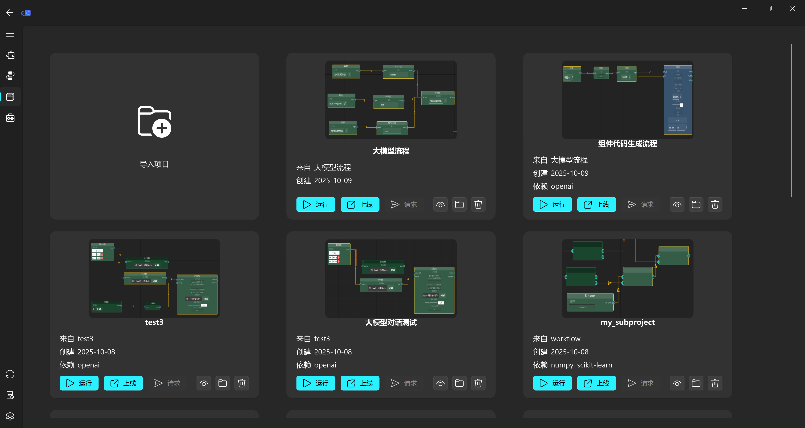

=================
导出项目测试
=================

CanvasMind 支持将任意子图导出为独立可运行的项目，无需依赖主程序即可部署到任何 Python 环境。

核心价值
--------

**将画布上的任意子图导出为可独立运行的项目**，实现从原型到生产的无缝迁移！

使用场景
~~~~~~~~

- **训练/推理分离**：只导出推理部分，打包训练好的模型文件
- **模型分享**：将完整工作流打包分享给同事
- **生产部署**：直接部署到服务器或 Docker 容器
- **离线运行**：在无 GUI 环境中执行工作流

导出功能特点
~~~~~~~~~~~~

✅ **智能依赖分析** - 自动识别并复制所需组件代码  
✅ **文件路径重写** - 模型文件、数据文件自动复制到项目目录并重写为相对路径  
✅ **列选择支持** - CSV 列选择配置完整保留  
✅ **环境隔离** - 自动生成 ``requirements.txt``，确保依赖一致性  
✅ **即开即用** - 包含完整运行脚本（CLI + API）

导出步骤
~~~~~~~~

1. **选择节点** - 在画布上选中要导出的节点（可多选）
2. **点击导出** - 点击左上角 **"导出模型"** 按钮（📤 图标）
3. **选择目录** - 选择导出目录，系统自动生成项目文件夹
4. **运行项目** - 进入导出目录，执行以下命令：

.. code-block:: bash

    # 安装依赖
    pip install -r requirements.txt

    # 运行模型
    python run.py

导出项目结构
~~~~~~~~~~~~

::

    model_xxxxxxxx/
    ├── model.workflow.json    # 工作流定义
    ├── project_spec.json      # 输入输出定义
    ├── preview.png            # 画布预览图
    ├── README.md              # 项目说明
    ├── requirements.txt       # 依赖包列表
    ├── run.py                 # CLI 运行脚本
    ├── api_server.py          # FastAPI 微服务
    ├── scan_components.py     # 组件扫描器
    ├── runner/                # 执行器模块
    │   ├── component_executor.py
    │   └── workflow_runner.py
    ├── components/            # 组件代码
    └── inputs/                # 输入文件

画布工具调用
------------

导出项目后，画布可直接调用项目执行脚本：

- **工具调用** - 画布可根据项目名称直接调用执行脚本，获取运行结果
- **参数传递** - 画布节点属性中支持工具调用参数，工具调用时自动传入
- **完整日志** - 详细记录并返回工具调用过程与结果日志，便于调试
- **大模型集成** - 提供标准化工具名称、输入/输出参数格式，无缝支持大模型 Function Calling

