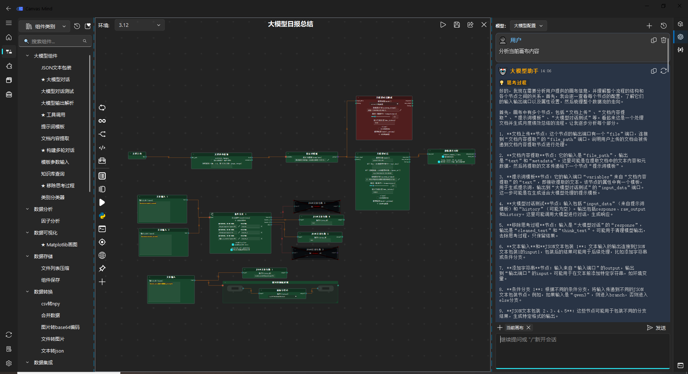

CanvasMind |version_str|
#########################

CanvasMind 是一款基于 Python 开发的可视化编程工作流开发工具。在传统数据流画布的基础上，CanvasMind 创新性地融合了 **全局变量系统** 、 **控制流执行机制** 、 **节点智能推荐引擎** ，以及 **大模型驱动的画布智能分析能力** ，实现从数据处理、逻辑编排到 AI 辅助推理的一体化低代码开发体验。

通过高度可定制的节点体系、流畅的交互界面与强大的后端执行支持（如 IPython 内核），CanvasMind 旨在为算法工程师、数据科学家和 AI 应用开发者提供一个 **高效、直观且可扩展** 的可视化编程环境。

----

**资源链接**
^^^^^^^^^^^

- 源码仓库：https://github.com/martin98-afk/CanvasMind  
- 问题反馈：https://github.com/martin98-afk/CanvasMind/issues  

Install
^^^^^^^^^^^

Requirements
------------

- Python 3.8+
- PyQt5 or PySide2

Install Dependencies
--------------------

.. code-block:: bash

    pip install -r requirements.txt

Run the Application
-------------------

.. code-block:: bash

    python main.py

Package with PyInstaller
------------------------

.. code-block:: bash

    pyinstaller --onedir --add-data "app;app" --add-data "icons;icons" --add-data "envs/Miniconda3-py311_23.11.0-2-Windows-x86_64.exe;envs" --add-data
 ".venv/Lib/site-packages/spyder;spyder" --add-data "resource;resource" --add-data "examples;examples" --copy-metadata jupyter_client --hidden-import jupyter_client.provisioning.local --hidden-import ipykernel -i icons/logo3.png main.py

> 💡 您也可以直接下载预打包的发行版：[点击此处获取 CanvasMind v0.1.7 完整压缩包](https://github.com/martin98-afk/CanvasMind/releases/download/v.0.1.7/CanvasMind.zip)

.. toctree::
    :hidden:
    :caption: 总览
    :name: orverview
    :maxdepth: 2
    :titlesonly:

    index
    整体介绍

.. toctree::
    :hidden:
    :caption: 画布开发
    :name: canvas
    :maxdepth: 2
    :titlesonly:

    canvas/开发基础设定
    canvas/画布基础操作
    canvas/节点拖拽树
    canvas/属性面板
    canvas/画布UI功能
    canvas/画布执行模式
    canvas/画布节点智能推荐
    canvas/组件调试模式
    canvas/画布项目导出

.. toctree::
    :hidden:
    :caption: 特殊节点介绍
    :name: nodes
    :maxdepth: 2

    nodes/分支节点
    nodes/迭代节点
    nodes/循环节点
    nodes/自定义代码节点
    nodes/工具调用节点

.. toctree::
    :hidden:
    :caption: 组件开发
    :name: component
    :maxdepth: 2
    :titlesonly:

    component/组件基础配置
    component/组件树使用
    component/组件调试
    component/组件版本管理
    component/组件开发大模型助手

.. toctree::
    :hidden:
    :caption: 项目管理
    :name: export
    :maxdepth: 2
    :titlesonly:

    export/导出项目测试
    export/导出项目服务上线

.. toctree::
    :hidden:
    :caption: 环境管理
    :name: environment
    :maxdepth: 2
    :titlesonly:

    environment/环境管理介绍

.. toctree::
    :hidden:
    :caption: Examples
    :name: examples
    :maxdepth: 1

    examples/react智能体
    examples/常用机器学习模型
    examples/自动生成组件

.. toctree::
    :hidden:
    :caption: 软件配置
    :name: settings
    :maxdepth: 2
    :titlesonly:

    settings/软件系统配置说明
