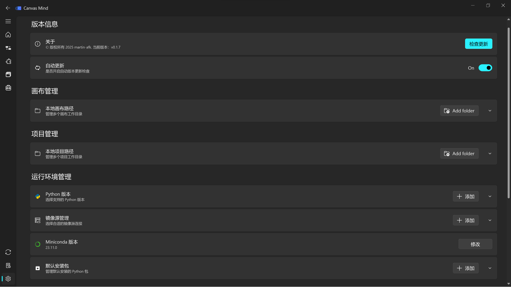

==================
软件系统配置说明
==================

版本信息配置
------------------

**版本更新检查**

**是否开关自动更新检查（打开软件检查）**

工作画布路径配置
------------------

**查看、增加、删除工作画布路径，会自动检测所有路径的画布**

导出项目路径配置
------------------

**查看、增加、删除导出项目路径**

运行环境配置
------------------

**查看、增加、删除支持的python版本**

**查看、增加、删除支持的python镜像源**

**修改预安装miniconda版本**

**查看、增加、删除python环境安装时默认安装的工具包**

画布配置
------------------

**更改画布运行方式，支持subprocess和ipython两种模式运行**

**更改画布网格样式**

**启动、关闭画布自动保存功能**

**更改画布自动保存的时间间隔**

**更改流程图连线样式**

**更改流程图呈现方向**

