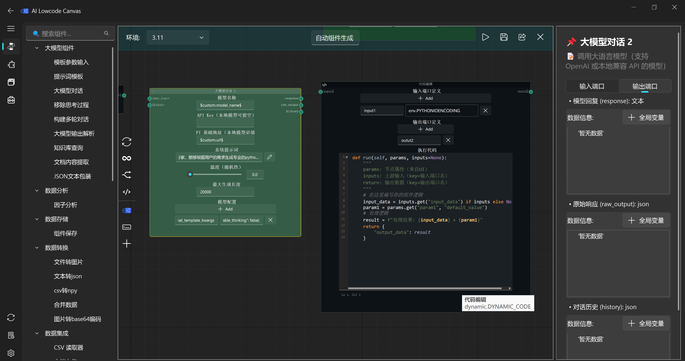

==========
UI Design
==========

🎨 Modern Fluent UI powered by `qfluentwidgets`.

界面特性
---------

- **深色主题**：半透明背景的现代化深色界面
- **响应式布局**：适配各种屏幕尺寸
- **橙色图标**：用户偏好的主题色
- **可调节字体**：支持字体大小和清晰度调节
- **多标签支持**：使用 TabBar 替代 QTabWidget，支持多编辑器
- **全屏模式**：支持当前页面全屏（而非整个窗口）

多视角画布拆分
--------------

CanvasMind 支持画布水平或垂直方向的无限拆分，便于在大规模工作流中同时监控物理距离较远的多个逻辑区域：

- **递归式视角拆分**：支持画布水平或垂直方向的无限拆分
- **场景状态实时同步**：所有视口共享同一个实时场景，编辑节点即时反映在所有视图
- **跨区域节点追踪**：在一个视口锁定查看"源头节点"参数，同时在另一视口实时观察"末端输出"表现

.. image:: _images/视角拆分.png
   :width: 800px
   :align: center
   :alt: Multi-View Splitting