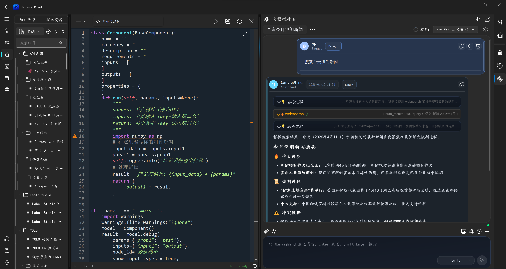

==================
大模型画布联动
==================

CanvasMind 深度集成了大语言模型（LLM）能力，实现了画布上下文感知的智能交互体验。当您在与 AI 对话时，系统会自动将当前画布的节点信息、变量状态等上下文注入对话，使 AI 能够"看懂"画布并提供精准的画布级操作建议。

界面示意图
----------

大模型助手面板位于画布右侧边栏，提供类似 ChatGPT 的对话式交互界面。

核心特性
--------

1. 画布上下文注入
~~~~~~~~~~~~~~~~~~~~~~~~

CanvasMind 会自动将以下信息作为上下文传给大模型：

- **节点 JSON**：当前画布中所有节点的配置信息（名称、类型、属性、连接关系）
- **变量状态**：全局变量（env、custom、node_vars）当前值
- **Base64 图片**：画布截图，帮助 AI 直观理解工作流结构
- **选中代码**：组件代码编辑器中选中的代码片段

这套机制让 AI 能够基于真实的画布状态提供建议，而非凭空想象。

.. image:: _images/上下文注入.gif
   :width: 800px
   :align: center
   :alt: 大模型上下文注入

2. 黄色跳转按钮（Jump）
~~~~~~~~~~~~~~~~~~~~~~~~

当 AI 的回复中引用了画布上**已存在**的节点时，系统会自动在回复中插入黄色按钮：

.. code-block:: text

    根据您的需求，我建议检查 [DataLoader](jump) 节点的输出格式...

点击 ``[DataLoader](jump)`` 按钮，画布会自动定位并高亮显示该节点，方便您快速验证或修改。

**使用场景：**
- AI 分析工作流后发现问题节点，点击直接跳转定位
- AI 解释某个节点的输出结果，点击跳转查看详情
- AI 推荐调整某个配置，点击跳转快速修改

3. 紫色创建按钮（Create）
~~~~~~~~~~~~~~~~~~~~~~~~

当 AI 推荐使用某个**尚未在画布上**的组件时，系统会自动插入紫色按钮：

.. code-block:: text

    要实现这个功能，您可以添加一个 [CSVWriter](create) 节点来导出结果...

点击 ``[CSVWriter](create)`` 按钮，系统会：

1. 从组件库中实例化该节点
2. 自动将其添加到画布
3. 根据上下文自动连接相关节点

**使用场景：**
- AI 识别到缺少某个处理节点，点击一键添加
- AI 推荐使用新组件，点击自动创建并连线
- AI 补全完整工作流，一键生成所需节点链

4. 多模态对话体验
~~~~~~~~~~~~~~~~~~~~~~~~

- **流式响应**：AI 回复逐字生成，流畅自然
- **Markdown 格式**：代码块、表格、列表完美呈现
- **上下文选择**：可手动选择注入"当前选中代码"或"当前文件"
- **停止生成**：可随时中断 AI 回复
- **历史记录**：支持上下文连续对话

使用指南
--------

1. **打开大模型对话**
   在画布界面右侧边栏找到并打开 "大模型对话" 面板

2. **配置 API**
   首次使用需要在右上角设置中配置大模型 API（支持 OpenAI API 兼容接口）

3. **选择上下文**（可选）
   - 点击输入框 左上的 clip按钮
   - 将 当前代码/画布信息 作为上下文注入对话

4. **发送指令**
   输入您的问题或指令，例如：
   
   - "帮我检查这个工作流的输入输出是否匹配"
   - "如何在数据处理后添加一个过滤器"
   - "这个节点运行失败的原因是什么"

5. **交互操作**
   - 点击黄色 ``[节点名](jump)`` → 跳转至该节点
   - 点击紫色 ``[组件名](create)`` → 创建并连线该组件
   - 复制代码块中的代码到编辑器使用

6. **停止生成**
   AI 生成过程中可点击"停止"按钮中断

技术实现
--------

CanvasMind 大模型功能基于以下架构：

- **上下文提取器**：自动扫描画布状态，生成结构化上下文
- **响应解析器**：实时解析 AI 回复，识别并生成交互按钮
- **画布操作引擎**：执行跳转、创建节点、自动连线等操作
- **多后端支持**：支持 OpenAI API 兼容接口，可对接各类大模型

上下文注入格式
~~~~~~~~~~~~~~

注入给大模型的上下文采用结构化 JSON 格式：

.. code-block:: json

    {
        "nodes": [
            {
                "id": "node_001",
                "name": "DataLoader",
                "category": "数据输入",
                "properties": {...},
                "inputs": [...],
                "outputs": [...]
            }
        ],
        "connections": [
            {"from": "node_001", "to": "node_002", "port": "output"}
        ],
        "variables": {
            "env": {...},
            "custom": {...},
            "node_vars": {...}
        },
        "canvas_image": "base64_encoded_image"
    }

这种结构化格式让大模型能够准确理解画布状态，避免幻觉和错误建议。
