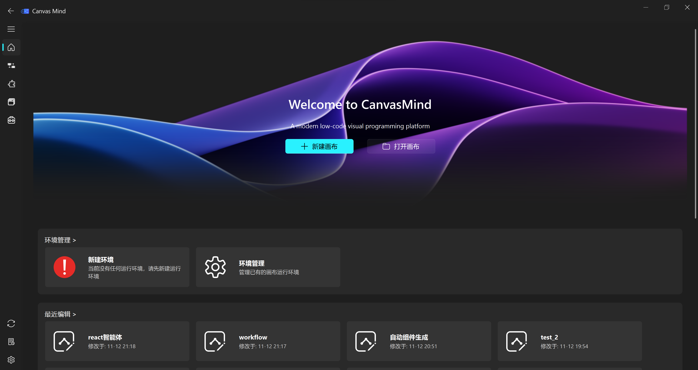

============
产品简介
============

一款现代化的低代码可视化编程平台，基于 **NodeGraphQt** 与 **qfluentwidgets** 深度构建，专为算法开发、AI工作流编排与数据处理场景设计，支持：

- ✅ **拖拽式组件编排**：通过直观的节点拖拽构建复杂数据流，无需编写底层代码
- ✅ **智能节点推荐**：支持画布智能推荐，根据画布内容推荐节点，提升工作效率
- ✅ **文件操作与流程控制**：内置文件读写、循环迭代、条件分支等高级控制节点
- ✅ **一键导出可执行项目**：将完整工作流打包为独立可运行的 Python 应用（支持 PyInstaller 打包），实现从原型到生产的无缝迁移
- ✅ **智能推荐与全局知识沉淀**：基于端口类型、连接频率与跨画布使用行为，智能推荐高相关节点，越用越智能
- ✅ **集成 IPython 内核**：支持在画布中嵌入交互式控制台，实时调试变量、查看数据结构（含 NumPy、Pandas 等复杂对象）
- ✅ **多画布协同管理**：支持同时打开多个工作流画布，独立保存与切换，满足复杂项目开发需求

从快速原型验证，到生产级部署，一步到位。

